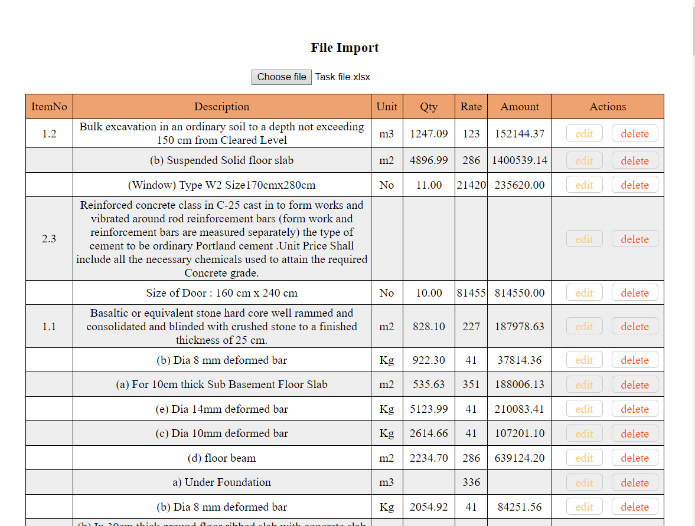
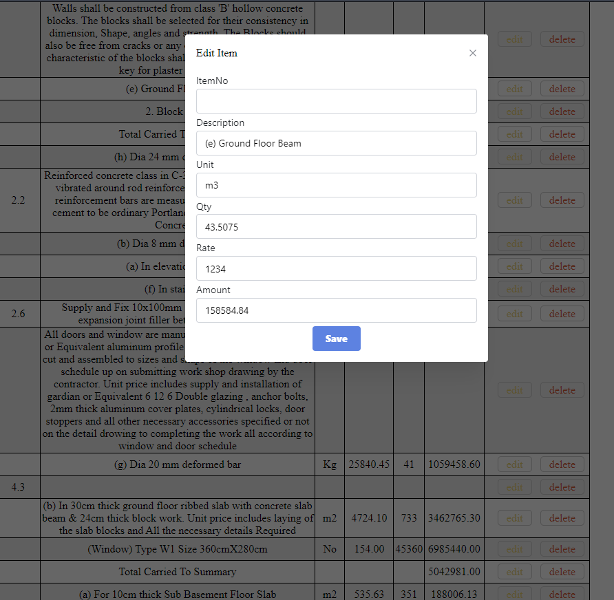

### How to run the app

- clone the repo
- cd to the folder and run the following commands in separate terminals
- run
  > cd server
  > yarn
  > yarn dev
- run
  > cd client
  > yarn
  > yarn dev

### Screenshots

